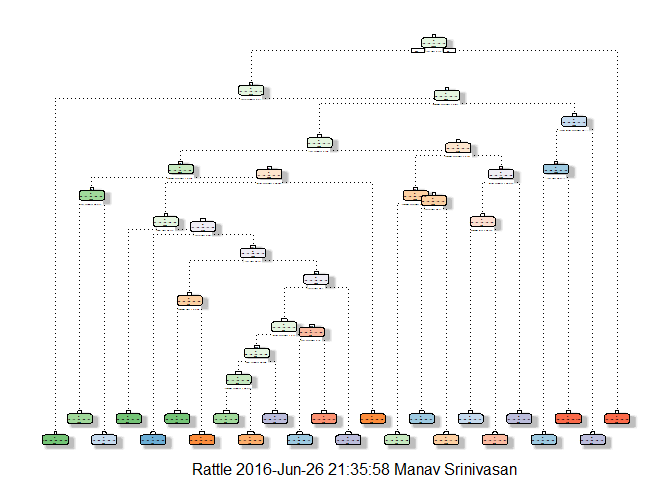

# Practical Machine Learning Course Project
Manav  
26 June 2016  

#Introduction

Using devices such as Jawbone Up, Nike FuelBand, and Fitbit it is now possible to collect a large amount of data about personal activity relatively inexpensively. These type of devices are part of the quantified self movement – a group of enthusiasts who take measurements about themselves regularly to improve their health, to find patterns in their behavior, or because they are tech geeks. One thing that people regularly do is quantify how much of a particular activity they do, but they rarely quantify how well they do it. In this project, your goal will be to use data from accelerometers on the belt, forearm, arm, and dumbell of 6 participants. They were asked to perform barbell lifts correctly and incorrectly in 5 different ways.

#Loading the Data

The test and training data are loaded into R

```r
library(rpart)
library(rpart.plot) 
```

```
## Warning: package 'rpart.plot' was built under R version 3.3.1
```

```r
library(caret)
```

```
## Warning: package 'caret' was built under R version 3.3.1
```

```
## Loading required package: lattice
```

```
## Loading required package: ggplot2
```

```r
library(randomForest)
```

```
## Warning: package 'randomForest' was built under R version 3.3.1
```

```
## randomForest 4.6-12
```

```
## Type rfNews() to see new features/changes/bug fixes.
```

```
## 
## Attaching package: 'randomForest'
```

```
## The following object is masked from 'package:ggplot2':
## 
##     margin
```

```r
library(rattle)
```

```
## Warning: package 'rattle' was built under R version 3.3.1
```

```
## Rattle: A free graphical interface for data mining with R.
## Version 4.1.0 Copyright (c) 2006-2015 Togaware Pty Ltd.
## Type 'rattle()' to shake, rattle, and roll your data.
```

```r
library(e1071)
```

```
## Warning: package 'e1071' was built under R version 3.3.1
```

```r
training<-read.csv("pml-training.csv",header=T,na.strings=c("NA"," ","#DIV/0!"))
testing<-read.csv("pml-testing.csv",header=T,na.strings=c("NA"," ","#DIV/0!"))
```

#Partitioning the Data

The training set is partitioned into sub training set and the test set.

```r
intrain<-createDataPartition(training$classe,p=0.7,list=FALSE)
train1<-training[intrain,]
test1<-training[-intrain,]
```

#Removing unwanted variables and missing values

The variables concerned with the time chunks are not of use in this analysis.
Hence such variables were removed from the test and training sets.

The missing values are removed by the following code:


```r
train1<-train1[,colSums(is.na(train1))==0]
test1<-test1[,colSums(is.na(test1))==0]
```

The columns 1 to 7 are removed as they are concerned with the time chunks.

```r
train1<-train1[,-c(1:7)]
test1<-test1[,-c(1:7)]
```

#Building Prediction Models
The predictions on the training set are using the Decision tree,Random
Forest and Generalized Boosted Model.

##Using the Decision tree

```r
set.seed(12)
dtree<-rpart(classe~.,data=train1,method="class",control=rpart.control(method="cv",number=4))
fancyRpartPlot(dtree)
```

```
## Warning: labs do not fit even at cex 0.15, there may be some overplotting
```

<!-- -->

The prediction on the test is done using the following code


```r
predicttree<-predict(dtree,newdata=test1,type="class")
confusionMatrix(predicttree,test1$classe)
```

```
## Confusion Matrix and Statistics
## 
##           Reference
## Prediction    A    B    C    D    E
##          A 1498  190   26   66   38
##          B   66  727   78   89   88
##          C   31  105  839  132  118
##          D   54   67   59  610   64
##          E   25   50   24   67  774
## 
## Overall Statistics
##                                           
##                Accuracy : 0.7558          
##                  95% CI : (0.7446, 0.7668)
##     No Information Rate : 0.2845          
##     P-Value [Acc > NIR] : < 2.2e-16       
##                                           
##                   Kappa : 0.6902          
##  Mcnemar's Test P-Value : < 2.2e-16       
## 
## Statistics by Class:
## 
##                      Class: A Class: B Class: C Class: D Class: E
## Sensitivity            0.8949   0.6383   0.8177   0.6328   0.7153
## Specificity            0.9240   0.9324   0.9206   0.9504   0.9654
## Pos Pred Value         0.8240   0.6937   0.6849   0.7143   0.8234
## Neg Pred Value         0.9567   0.9148   0.9599   0.9296   0.9377
## Prevalence             0.2845   0.1935   0.1743   0.1638   0.1839
## Detection Rate         0.2545   0.1235   0.1426   0.1037   0.1315
## Detection Prevalence   0.3089   0.1781   0.2082   0.1451   0.1597
## Balanced Accuracy      0.9094   0.7853   0.8691   0.7916   0.8404
```

##Using the Random Forest

```r
rfor<-randomForest(classe~.,data=train1)
predictrfor<-predict(rfor,newdata=test1,type="class")
confusionMatrix(predictrfor,test1$classe)
```

```
## Confusion Matrix and Statistics
## 
##           Reference
## Prediction    A    B    C    D    E
##          A 1672    5    0    0    0
##          B    1 1133    2    0    0
##          C    0    1 1024    9    0
##          D    0    0    0  955    4
##          E    1    0    0    0 1078
## 
## Overall Statistics
##                                           
##                Accuracy : 0.9961          
##                  95% CI : (0.9941, 0.9975)
##     No Information Rate : 0.2845          
##     P-Value [Acc > NIR] : < 2.2e-16       
##                                           
##                   Kappa : 0.9951          
##  Mcnemar's Test P-Value : NA              
## 
## Statistics by Class:
## 
##                      Class: A Class: B Class: C Class: D Class: E
## Sensitivity            0.9988   0.9947   0.9981   0.9907   0.9963
## Specificity            0.9988   0.9994   0.9979   0.9992   0.9998
## Pos Pred Value         0.9970   0.9974   0.9903   0.9958   0.9991
## Neg Pred Value         0.9995   0.9987   0.9996   0.9982   0.9992
## Prevalence             0.2845   0.1935   0.1743   0.1638   0.1839
## Detection Rate         0.2841   0.1925   0.1740   0.1623   0.1832
## Detection Prevalence   0.2850   0.1930   0.1757   0.1630   0.1833
## Balanced Accuracy      0.9988   0.9971   0.9980   0.9949   0.9980
```

#Using the Generalized Boosted Model

```r
mgbm<-train(classe~.,data=train1,method="gbm",trControl=trainControl(method="cv",number=4),verbose=F)
```

```
## Loading required package: gbm
```

```
## Warning: package 'gbm' was built under R version 3.3.1
```

```
## Loading required package: survival
```

```
## 
## Attaching package: 'survival'
```

```
## The following object is masked from 'package:caret':
## 
##     cluster
```

```
## Loading required package: splines
```

```
## Loading required package: parallel
```

```
## Loaded gbm 2.1.1
```

```
## Loading required package: plyr
```

```r
predictgbm<-predict(mgbm,test1)
confusionMatrix(predictgbm,test1$classe)
```

```
## Confusion Matrix and Statistics
## 
##           Reference
## Prediction    A    B    C    D    E
##          A 1647   29    0    1    3
##          B   17 1077   19    4    7
##          C    7   31  987   34    5
##          D    1    1   17  921   19
##          E    2    1    3    4 1048
## 
## Overall Statistics
##                                           
##                Accuracy : 0.9652          
##                  95% CI : (0.9602, 0.9697)
##     No Information Rate : 0.2845          
##     P-Value [Acc > NIR] : < 2.2e-16       
##                                           
##                   Kappa : 0.9559          
##  Mcnemar's Test P-Value : 0.0001042       
## 
## Statistics by Class:
## 
##                      Class: A Class: B Class: C Class: D Class: E
## Sensitivity            0.9839   0.9456   0.9620   0.9554   0.9686
## Specificity            0.9922   0.9901   0.9842   0.9923   0.9979
## Pos Pred Value         0.9804   0.9582   0.9276   0.9604   0.9905
## Neg Pred Value         0.9936   0.9870   0.9919   0.9913   0.9930
## Prevalence             0.2845   0.1935   0.1743   0.1638   0.1839
## Detection Rate         0.2799   0.1830   0.1677   0.1565   0.1781
## Detection Prevalence   0.2855   0.1910   0.1808   0.1630   0.1798
## Balanced Accuracy      0.9880   0.9678   0.9731   0.9738   0.9832
```

Since the Random Forest has higher accuracy than Decision tree and the Boosted Model,it is chosen as the most preferred option.

#Results
Thus the predictions on the test set is given below.

```r
predict(rfor,newdata=testing)
```

```
##  1  2  3  4  5  6  7  8  9 10 11 12 13 14 15 16 17 18 19 20 
##  B  A  B  A  A  E  D  B  A  A  B  C  B  A  E  E  A  B  B  B 
## Levels: A B C D E
```
